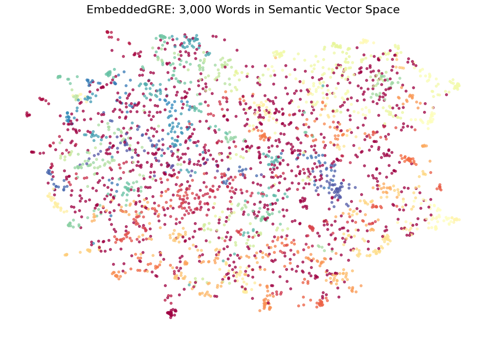

# 🔴 EmbeddedGRE: AI-Powered Semantic Vocabulary Clustering

EmbeddedGRE is a Machine Learning pipeline that modernizes GRE vocabulary studying. Instead of relying on traditional, alphabetical A-Z lists, this project uses advanced Sentence Transformers to group 3,000 GRE words into mathematical, meaning-based clusters.

## 💡 The Problem with A-Z Lists
Traditional GRE study guides group words like *abase* and *abash* together simply because they start with the letter "A". This ignores how the human brain actually learns language: through contextual and functional relationships.

## 🛠️ The AI Solution: "The Blindfold Technique"
This project utilizes **BAAI/bge-large-en-v1.5**, a state-of-the-art embedding model, to map the English definitions of 3,000 words into a high-dimensional vector space. 
By "blindfolding" the AI to the spelling of the word and only feeding it the definition, we eliminate prefix bias and achieve pure semantic clustering. 

### Technology Stack:
* **Embeddings:** `SentenceTransformers` (BGE-Large)
* **Dimensionality Reduction:** `UMAP` (to compress the 384-dimensional space)
* **Clustering:** `HDBSCAN` (to automatically discover the natural number of semantic categories)

## 📊 Sample Output
The AI successfully discovered highly specific functional categories, such as:
* **Category 0 (Exoneration/Freeing):** *absolve, exculpate, exempt, exonerate, extricate*
* **Category 7 (Extreme Praise):** *adulate, encomium, eulogize, exalt, extol, laudatory*
* **Category 15 (Clever/Noticeable):** *astute, conspicuous, equivocate, ingenious, knack, palpable, shrewd*

## 🚀 How to Use

**1. Download the Final List**
If you just want to study the words, download the final clustered CSV here: [Final_EmbeddedGRE_List.csv](link_to_your_csv_file) (Perfect for importing into Notion or Anki).

**2. Run the Code Yourself**
Click the badge below to open the Python pipeline in Google Colab and tweak the clustering parameters yourself!

